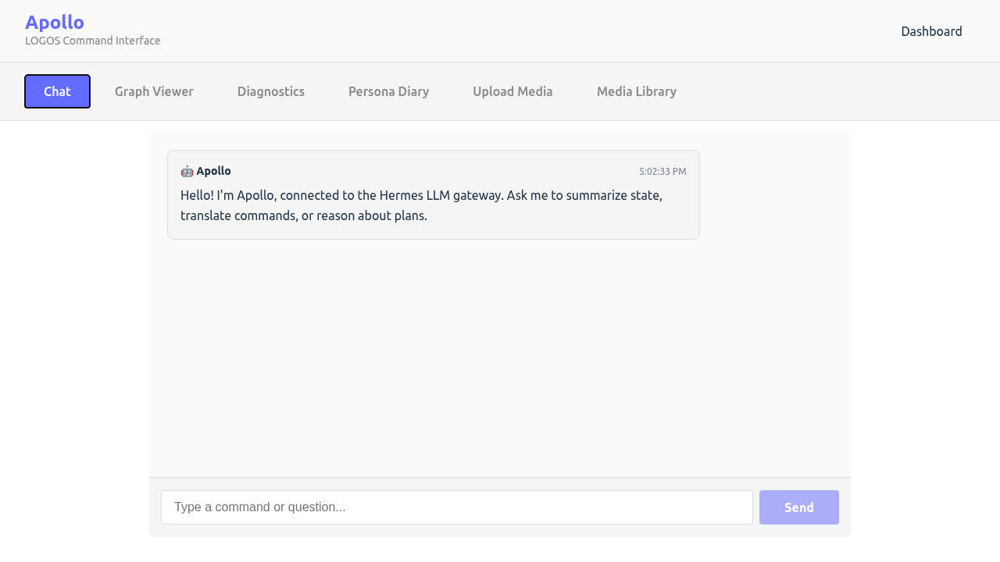
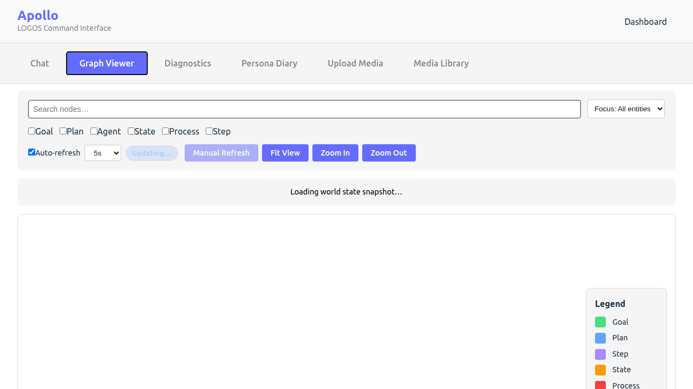
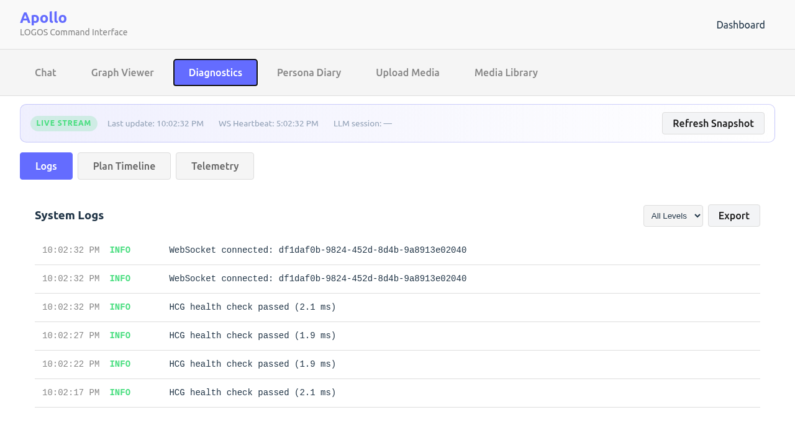

# Phase 2 Verification

**Date:** 2025-12-02

## Status

| Milestone | Status |
|-----------|--------|
| M1: Services Online | ✅ |
| M2: Apollo Dual Surface | ✅ |
| M3: Media Ingestion | ✅ |
| M4: Observability | ✅ |

---

## M1: Services

- [sophia_health.json](p2-m1/sophia_health.json)
- [hermes_health.json](p2-m1/hermes_health.json)
- [apollo_api_health.json](p2-m1/apollo_api_health.json)

## M2: Apollo Surfaces

**CLI:**
- [cli_help_output.txt](p2-m2/cli_help_output.txt)
- [cli_status_output.txt](p2-m2/cli_status_output.txt)

**Webapp:**

| Component | Screenshot |
|-----------|------------|
| Chat |  |
| Graph Viewer |  |
| Diagnostics (Logs) |  |
| Plan Timeline |  |
| Telemetry |  |
| Persona Diary |  |
| Media Upload |  |
| Media Library |  |

## M3: Media Ingestion

- Media upload UI functional
- Media library shows uploaded samples
- Full pipeline: Apollo → Hermes → Sophia verified

## M4: Observability

**Screenshots:**
- Diagnostics Logs (see above)
- Plan Timeline (see above)
- Telemetry dashboard (see above)
- Persona Diary (see above)

**API Evidence:**
- [diagnostics_logs_api.json](p2-m4/diagnostics_logs_api.json)
- [persona_api.json](p2-m4/persona_api.json)

---

## Regenerate

```bash
cd apollo/webapp && npx playwright test phase2-verification.spec.ts
```
